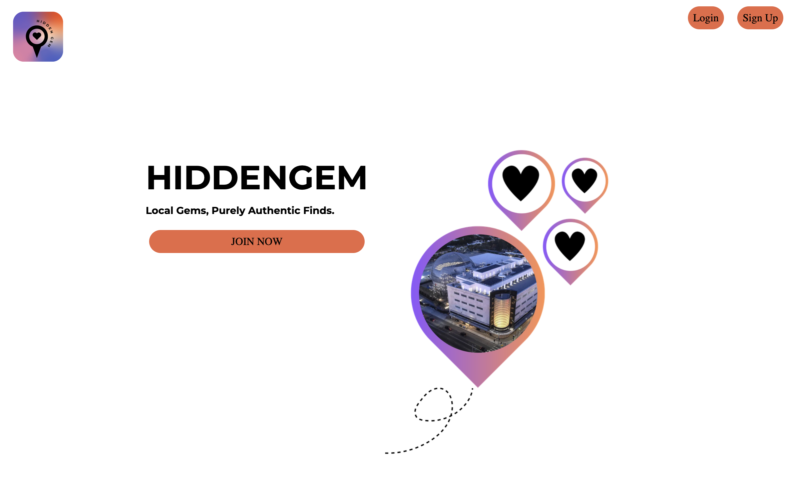

# App Introduction - Hiddengem App

### Project Choice: 
Hidden gems recommendation App

### Project Inspriation: 
We wanted to build an app where people can share fun places to hang out, but unlike normal apps like Yelp, we wanted to focus on hidden gems in cities for people who have niche interests.

### Project Description:
An app that allows you to find all hidden gems, create and share your own hidden gems, like and comment other people's hiddengem recommendations.  Create a whole community for the niche groups to share fun places to hang out and interact with each other.

### Key Features:
#### Browse all hidden gems and filter on them:
This app will allow AUU users to browser all the hidden gems that have been created by other people. They can click into each hidden gem for details, such as title, category, location, description and author. Users can also filter on the the hidden gems by "Category" or "Author".

#### Interact with all hidden gems recommendations:
This app will allow AUU users to like and comment on other users' posts. They can also like other people's comments as well.

#### Make your own hidden gems and filter on them:
This app will also AUU users to create their own hidden gems. They can filter on their own hidden gems by category or search by the name of hidden gems. 

### Getting Started: 
* [Deployed Link](https://hiddengem-c5bf2312043b.herokuapp.com/)
* [Repo Link](https://github.com/jaeman308/hiddengem)
* [Trello Link](https://trello.com/b/M7Fb3zXR/hidden-gem)

### Next step:
* Interactive Map: Show hidden gems on an interactive map so users can search by proximity. 
* Distance: Display how far the gem is from the user’s current location.
* Directions Integration: Users can easily get directions to the location using Google Maps or Apple Maps.

### Technologies Used: 
* Python
* Django
* SQL

### Attributes
* Canva: Images and logo. 
